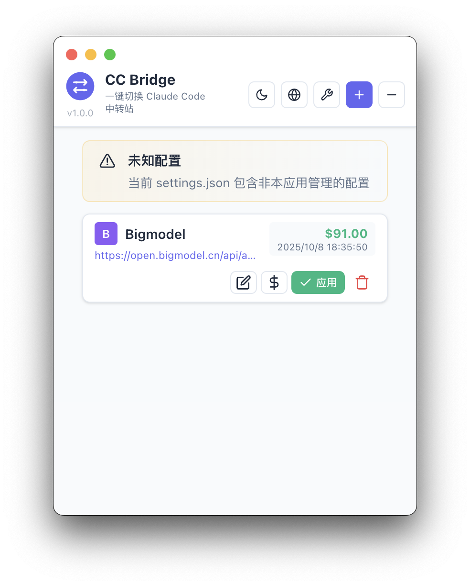
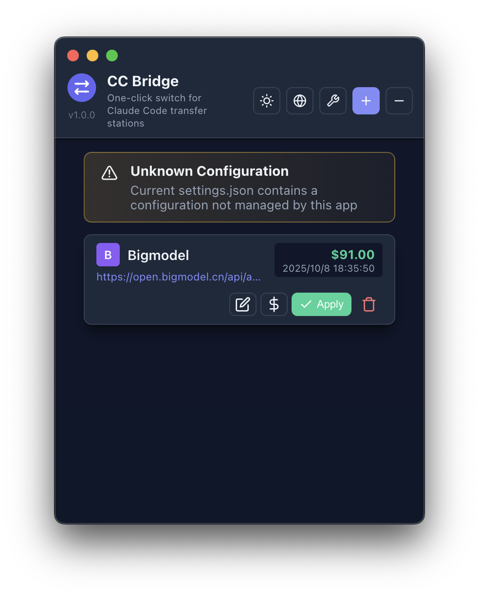
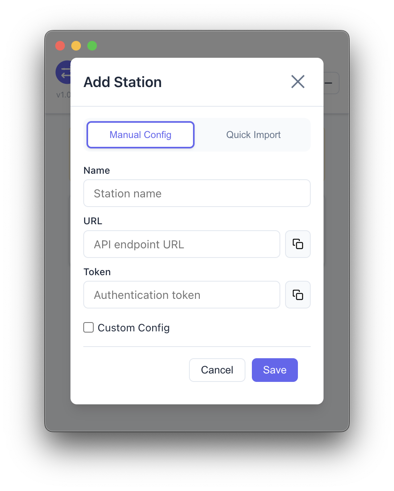

<div align="center">


# 🌉 CC Bridge

**一站式管理 Claude Code 与 Codex 中转站的桌面应用**

[](https://opensource.org/licenses/MIT)
[](https://github.com/aydomini/CC-Bridge/releases)
[]()

---

### [中文](README.md) | [English](README_EN.md)

</div>

---

## ✨ 项目简介

CC Bridge 是一款 **免费开源** 的 Electron + React 桌面应用，专为需要频繁切换多个 AI 中转站的开发者打造。现已支持 **Claude Code** 与 **OpenAI Codex** 双模式管理，提供统一的配置体验。

### 核心功能

- 🔄 **一键切换站点**：支持多个中转站配置，点击应用即可切换，自动备份原配置
- 🔐 **安全加密存储**：AES-256-CBC 加密存储 API 令牌，设备绑定密钥，本地加密
- ⚙️ **灵活配置系统**：全局默认配置 + 站点自定义配置 + 项目级配置文件，满足各种使用场景
- 📝 **项目配置编辑**：直接编辑 `CLAUDE.md` / `AGENTS.md`，统一管理项目级指令与记忆
- 💰 **余额追踪**：为每个站点设置余额与货币，实时掌握使用情况
- 🌍 **中英双语**：界面支持中英文切换，适配深色/浅色主题
- 🖥️ **菜单栏托盘**：常驻托盘，快速切换站点与模式，无需打开主窗口
- 📦 **快速导入**：Claude 模式支持 JSON 快速导入，自动修复格式问题（中文标点、缺失逗号、智能引号等）

> **最新版本**：v1.2.5 - [下载地址](https://github.com/aydomini/CC-Bridge/releases)
> **当前平台**：macOS (Apple Silicon)。Windows / Linux / Intel Mac 正在规划中,欢迎贡献代码。

---

## 📸 界面预览

<table>
  <tr>
    <td width="50%">
      
      <p align="center"><b>主界面（浅色模式）</b></p>
    </td>
    <td width="50%">
      
      <p align="center"><b>主界面（深色模式）</b></p>
    </td>
  </tr>
  <tr>
    <td width="50%">
      
      <p align="center"><b>添加站点对话框</b></p>
    </td>
    <td width="50%">
      
      <p align="center"><b>快速导入（JSON）</b></p>
    </td>
  </tr>
</table>

---

## 🎉 v1.2.5 更新内容

### 快速导入功能全面优化

- ✨ **双模式快速导入**：Claude 与 Codex 模式均支持快速导入
  - **Claude 模式**：支持环境变量格式 + JSON 格式
  - **Codex 模式**：支持环境变量格式 + 完整 TOML 配置
- 📝 **详细提示文本**：输入框显示支持的格式示例，新手友好
- 🔧 **智能格式检测**：
  - 自动识别环境变量格式（`KEY=VALUE`）
  - 自动识别 JSON 格式（Claude）
  - 自动识别 TOML 格式（Codex）
- 🧹 **清理空配置**：环境变量导入不再产生空的 `{}` 自定义配置
- 🎯 **模糊键名匹配**：支持多种令牌和 URL 键名变体
  - Claude: `ANTHROPIC_AUTH_TOKEN`, `AUTH_TOKEN`, `TOKEN`, `API_KEY` 等
  - Codex: `OPENAI_API_KEY`, `API_KEY`, `TOKEN`, `KEY` 等
  - URL: `BASE_URL`, `API_URL`, `ENDPOINT`, `URL` 等

**Claude 模式快速导入示例**：

环境变量格式：
```bash
ANTHROPIC_AUTH_TOKEN=sk-ant-xxxxx
ANTHROPIC_BASE_URL=https://api.example.com
```

JSON 格式：
```json
{
  "env": {
    "ANTHROPIC_AUTH_TOKEN": "sk-ant-xxxxx",
    "ANTHROPIC_BASE_URL": "https://api.example.com"
  }
}
```

**Codex 模式快速导入示例**：

环境变量格式：
```bash
OPENAI_API_KEY=sk-xxxxx
BASE_URL=https://api.example.com
```

完整 TOML 配置（自动拆分为覆写配置 + 附加配置）：
```toml
model_provider = "openai"
model = "gpt-4"

[model_providers.custom]
base_url = "https://api.example.com"
wire_api = "openai"
requires_openai_auth = true

[[mcp_servers]]
name = "filesystem"
command = "npx"
args = ["-y", "@modelcontextprotocol/server-filesystem"]
```

### Bug 修复

- 🐛 修复 Codex 模式配置预览中重复显示 `# --- Advanced Configuration ---` 标记的问题
- 🐛 修复环境变量格式导入后出现空 `{}` 配置的问题
- 🐛 统一前端预览和后端生成的配置标记格式

---

## 📦 安装说明

### macOS (Apple Silicon)

1. 从 [Releases](https://github.com/aydomini/CC-Bridge/releases) 下载最新版 `CC Bridge-x.x.x-arm64.dmg`
2. 打开 DMG，将 **CC Bridge** 拖入「应用程序」文件夹
3. 首次启动需绕过 Gatekeeper 验证（应用使用临时签名）：
   - **方法 1**：右键点击应用 → 选择「打开」→ 再次点击「打开」
   - **方法 2**：系统设置 → 隐私与安全性 → 找到 CC Bridge → 点击「仍要打开」
   - **方法 3**：在终端执行：`xattr -cr "/Applications/CC Bridge.app"`

> **说明**：应用未购买 Apple 开发者证书（$99/年），使用 Adhoc Signing。所有源码开放，可自行审计安全性。

---

## 🚀 使用指南

### 1️⃣ 选择模式

应用支持两种模式，可随时切换：

- **Claude Code 模式**：管理 Claude Code CLI 的中转站配置（`~/.claude/settings.json`）
- **Codex 模式**：管理 OpenAI Codex CLI 的中转站配置（`~/.codex/config.toml` + `auth.json`）

在主界面顶部可切换当前模式。

### 2️⃣ 添加站点

点击右上角 **「+」** 按钮，填写站点信息：

| 字段 | Claude 模式 | Codex 模式 | 说明 |
|------|-------------|------------|------|
| **站点名称** | 必填 | 必填 | 为站点起个好记的名字（如「生产站」「测试站」） |
| **Provider Key** | 不适用 | 可选 | 提供商标识，默认根据域名生成 |
| **Base URL** | 必填 | 必填 | 中转站的 API 端点地址（如 `https://api.example.com`） |
| **Auth Token** | 必填 | 必填 | Claude 填 `ANTHROPIC_AUTH_TOKEN`，Codex 填 `OPENAI_API_KEY` |
| **自定义配置** | 可选 | 可选 | JSON 格式的配置覆盖，会与全局配置合并 |
| **余额** | 可选 | 可选 | 设置余额与货币，方便追踪消费 |

#### 快速导入

点击「快速导入」按钮，支持以下格式：

- **环境变量格式**：`KEY=VALUE` 格式的键值对（支持多行）
- **JSON 配置格式**（Claude 模式）：包含 `env`、`permissions` 等字段的 JSON 对象
- **TOML 配置格式**（Codex 模式）：完整的 TOML 配置，自动拆分为覆写配置和附加配置

程序会自动修复常见格式问题（中文标点、缺失逗号、智能引号等），并保留所有自定义字段。

> 💡 详细的格式示例和功能说明，请参考上方的「v1.2.5 更新内容」章节。

### 3️⃣ 应用配置

选中目标站点，点击 **「应用」** 按钮：

- **Claude 模式**：配置写入 `~/.claude/settings.json`
- **Codex 模式**：配置写入 `~/.codex/config.toml` 和 `~/.codex/auth.json`

应用前会自动创建带时间戳的备份文件（如 `settings.json.backup.1234567890`），自动保留最近 1 个备份。如需恢复，备份文件位于配置文件同目录。

> ⚠️ **重要提示**：如果 Claude Code CLI 正在运行，应用配置后需手动重启 CLI 以生效。

### 4️⃣ 全局配置

点击顶部 **「⚙️ 全局配置」** 按钮，可编辑：

#### 基础配置（Base Config）

- **Claude 模式**：编辑默认的环境变量（`env`）和权限配置（`permissions`）
  - 支持任意自定义字段，可在顶层添加 `timeout`、`retryAttempts` 等额外配置
  - `env` 字段支持添加任意环境变量（如 `MY_CUSTOM_VAR`）
  - 示例：
    ```json
    {
      "env": {
        "API_TIMEOUT_MS": "30000",
        "CUSTOM_VAR": "value"
      },
      "permissions": {
        "allow": ["read", "write"],
        "deny": []
      },
      "timeout": 5000,
      "customSettings": {
        "feature": "enabled"
      }
    }
    ```
- **Codex 模式**：编辑默认的模型配置（`model`、`model_provider` 等），同样支持顶层自定义字段扩展

文件路径提示：
- Claude：`~/.claude/settings.json`
- Codex：`~/.codex/config.toml` + `~/.codex/auth.json`

#### 项目配置（Project Config）

直接在应用内编辑项目级配置文件：

- **Claude 模式**：编辑 `~/.claude/CLAUDE.md`
- **Codex 模式**：编辑 `~/.codex/AGENTS.md`

这些文件用于存储项目级的系统提示词、记忆库、工作流规则等，会在所有会话中生效。

保存时自动创建备份，保留最近 1 个版本。

### 5️⃣ 菜单栏托盘

应用常驻菜单栏，提供快速操作：

- **模式分组**：Claude / Codex 站点分别列出
- **一键切换**：点击站点名称即可应用配置，无需打开主窗口
- **外部警告**：如果检测到配置文件被外部修改（非本应用管理），会显示 ⚠️ 提示
- **模式指示**：当前激活的模式会标注「（当前模式）」

---

## 🛠️ 本地开发

### 环境要求

- **Node.js** 16 或更高版本
- **npm** 7 或更高版本
- **git**

### 快速开始

```bash
# 克隆仓库
git clone https://github.com/aydomini/CC-Bridge.git
cd CC-Bridge

# 安装依赖
npm install

# 开发模式（带热重载）
npm run dev

# 构建生产版本
npm run build

# 打包应用
npm run package
```

### 项目结构

```
CC-Bridge/
├── electron/                # Electron 主进程
│   ├── main.ts              # 应用入口、窗口管理、托盘菜单
│   ├── preload.ts           # IPC 安全桥接
│   └── services/            # 核心服务
│       ├── configManager.ts # 站点与配置管理
│       ├── settingsWriter.ts# 配置文件写入
│       └── encryption.ts    # AES-256 加密服务
├── src/                     # React 渲染进程
│   ├── App.tsx              # 主界面逻辑
│   ├── components/          # UI 组件
│   │   ├── StationList.tsx  # 站点列表
│   │   ├── StationDialog.tsx# 添加/编辑站点
│   │   ├── BaseConfigDialog.tsx # 全局配置 + 项目配置
│   │   └── ...
│   ├── contexts/            # React Context
│   │   ├── ThemeContext.tsx # 主题管理
│   │   └── LanguageContext.tsx # 多语言管理
│   └── types/               # TypeScript 类型定义
└── build/                   # 静态资源（图标、签名配置）
```

### 技术栈

- **前端**：React 18 + TypeScript + Vite
- **后端**：Electron + Node.js
- **加密**：crypto (AES-256-CBC)
- **存储**：electron-store (JSON)
- **构建**：electron-builder

---

## 🤝 参与贡献

欢迎为 CC Bridge 贡献代码！请遵循以下流程：

1. **Fork** 本仓库并基于 `main` 分支创建功能分支
2. **开发**时注意同时支持 Claude / Codex 模式
3. **提交** PR 前执行 `npm run build` 确保构建成功
4. **同步更新**中英文 README 文档
5. **附上测试说明**或界面截图

### 报告问题 & 功能建议

- 提交 Issue：[GitHub Issues](https://github.com/aydomini/CC-Bridge/issues)
- 功能讨论：[GitHub Discussions](https://github.com/aydomini/CC-Bridge/discussions)

---

## ⭐ Star History

[](https://star-history.com/#aydomini/CC-Bridge&Date)

---

## 📄 开源协议

本项目采用 [MIT License](LICENSE) 开源协议 - 自由使用、修改、分发。

---

<div align="center">

**用 ❤️ 为 Claude Code 与 Codex 社区打造**

如果 CC Bridge 帮到了你，欢迎点个 ⭐ Star 支持！

</div>
