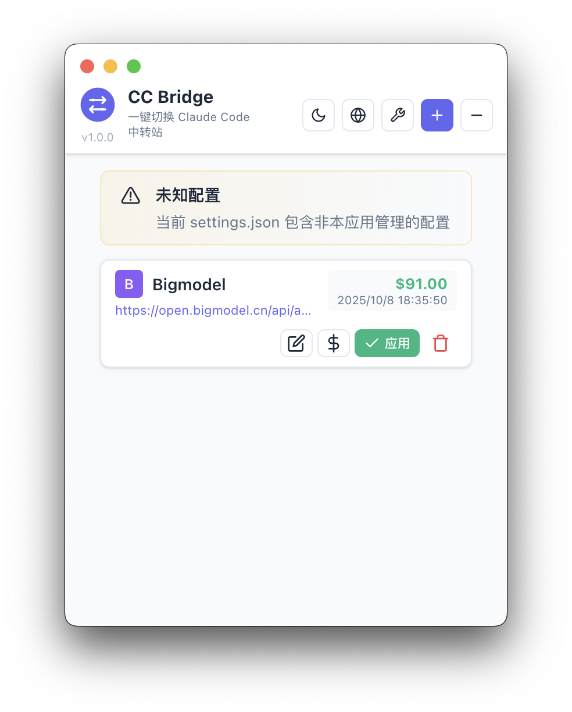
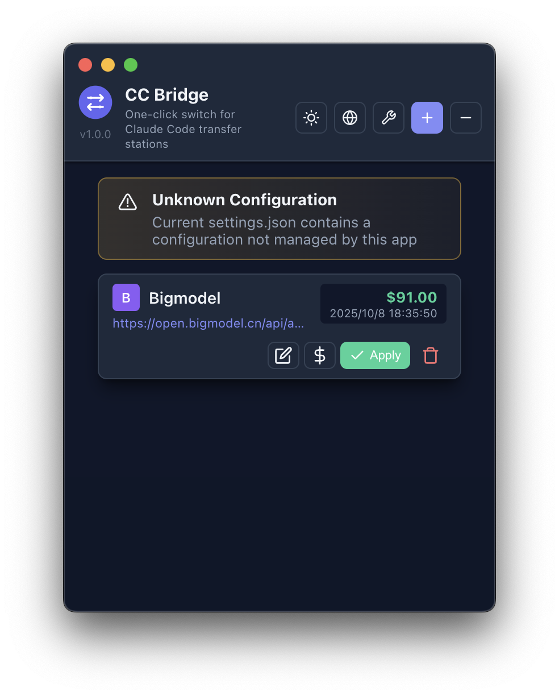
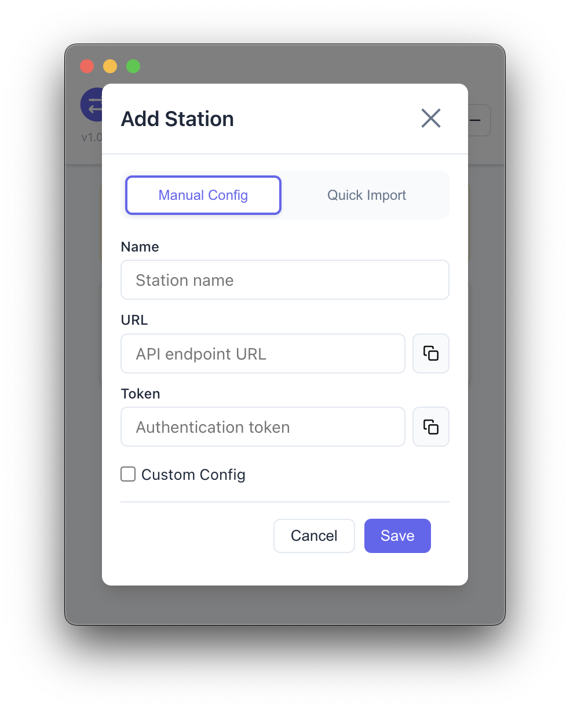
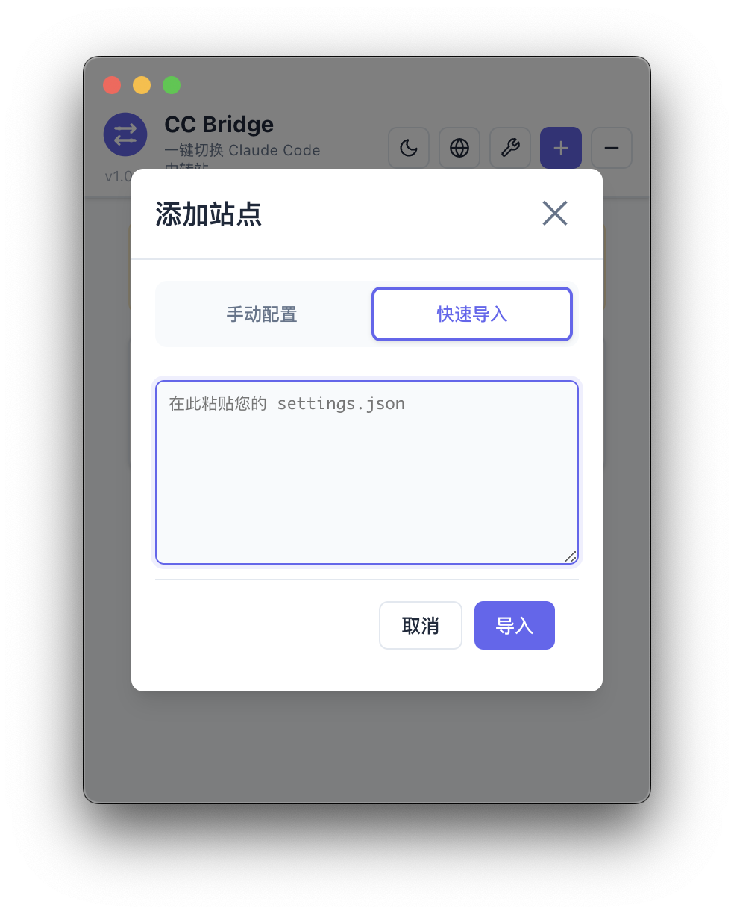

<div align="center">


# 🌉 CC Bridge

**Manage Claude Code & Codex transfer stations from one desktop app**

[](https://opensource.org/licenses/MIT)
[](https://github.com/aydomini/CC-Bridge/releases)
[]()

---

### [English](README_EN.md) | [中文](README.md)

</div>

---

## ✨ Overview

CC Bridge is a **free & open-source** Electron + React desktop application designed for developers who frequently switch between multiple AI transfer stations. It supports both **Claude Code** and **OpenAI Codex** modes with a unified configuration experience.

### Core Features

- 🔄 **One-Click Station Switching**: Manage multiple transfer stations, apply configurations instantly, automatic backups
- 🔐 **Military-Grade Encryption**: AES-256-CBC encrypted token storage with device-bound keys
- ⚙️ **Flexible Configuration System**: Global defaults + per-station overrides + project-level config files
- 📝 **Project Config Editor**: Edit `CLAUDE.md` / `AGENTS.md` directly, manage project-level instructions and memory
- 💰 **Balance Tracking**: Set balance and currency for each station, monitor usage
- 🌍 **Bilingual UI**: Switch between English and Chinese, dark/light theme support
- 🖥️ **Menu Bar Tray**: Persistent tray icon for quick station/mode switching without opening the main window
- 📦 **Quick Import**: Claude mode supports JSON quick import with auto-fix for format issues (Chinese punctuation, missing commas, smart quotes, etc.)

> **Latest Version**: v1.2.4 - [Download](https://github.com/aydomini/CC-Bridge/releases)
> **Current Platform**: macOS (Apple Silicon). Windows / Linux / Intel Mac are planned—PRs welcome!

---

## 📸 Screenshots

<table>
  <tr>
    <td width="50%">
      
      <p align="center"><b>Main Interface (Light Mode)</b></p>
    </td>
    <td width="50%">
      
      <p align="center"><b>Main Interface (Dark Mode)</b></p>
    </td>
  </tr>
  <tr>
    <td width="50%">
      
      <p align="center"><b>Add Station Dialog</b></p>
    </td>
    <td width="50%">
      
      <p align="center"><b>Quick Import (JSON)</b></p>
    </td>
  </tr>
</table>

---

## 🎉 v1.2.4 Update

### Codex Mode Configuration Editor Enhancement

- ✨ **Dual-Tab Design**: Custom configuration now split into two tabs
  - **Override (JSON)**: Override global base config fields in JSON format (e.g., `model`, `modelReasoningEffort`)
  - **Additional (TOML)**: Add extra TOML configuration sections (e.g., `[[mcp_servers]]`)
- 🎨 **Elegant Placeholder Text**: Input boxes display formatted example code for clarity
- 📝 **Clear Separation of Concerns**:
  - Override tab: Modify base configuration fields
  - Additional tab: Add custom TOML sections
- 🔍 **Live Preview**: Both configurations are automatically merged and displayed in the preview area

**Usage Examples**:

Override (JSON):
```json
{
  "model": "gpt-4",
  "modelReasoningEffort": "medium"
}
```

Additional (TOML):
```toml
[[mcp_servers]]
name = "filesystem"
command = "npx"
args = ["-y", "@modelcontextprotocol/server-filesystem"]
```

---

## 📦 Installation

### macOS (Apple Silicon)

1. Download the latest `CC Bridge-x.x.x-arm64.dmg` from [Releases](https://github.com/aydomini/CC-Bridge/releases)
2. Mount the DMG and drag **CC Bridge** into the Applications folder
3. First launch requires bypassing Gatekeeper (adhoc-signed app):
   - **Method 1**: Right-click the app → Select "Open" → Click "Open" again
   - **Method 2**: System Settings → Privacy & Security → Find CC Bridge → Click "Open Anyway"
   - **Method 3**: Run in Terminal: `xattr -cr "/Applications/CC Bridge.app"`

> **Note**: The app is adhoc-signed (no paid Apple Developer certificate). All source code is public for security auditing.

---

## 🚀 User Guide

### 1️⃣ Select Mode

The app supports two modes that can be switched anytime:

- **Claude Code Mode**: Manage Claude Code CLI transfer station configs (`~/.claude/settings.json`)
- **Codex Mode**: Manage OpenAI Codex CLI transfer station configs (`~/.codex/config.toml` + `auth.json`)

Switch modes using the mode selector at the top of the main interface.

### 2️⃣ Add Stations

Click the **"+"** button in the top-right corner and fill in the station details:

| Field | Claude Mode | Codex Mode | Description |
|-------|-------------|------------|-------------|
| **Station Name** | Required | Required | A memorable name (e.g., "Production", "Test") |
| **Provider Key** | N/A | Optional | Provider identifier, defaults to domain-based key |
| **Base URL** | Required | Required | Transfer station API endpoint (e.g., `https://api.example.com`) |
| **Auth Token** | Required | Required | Claude: `ANTHROPIC_AUTH_TOKEN`, Codex: `OPENAI_API_KEY` |
| **Custom Config** | Optional | Optional | JSON configuration overrides merged with global defaults |
| **Balance** | Optional | Optional | Set balance and currency for expense tracking |

#### Quick Import (Claude Mode Only)

Click the "Quick Import" button and paste JSON configuration:

```json
{
  "name": "Production",
  "baseUrl": "https://api.example.com",
  "authToken": "sk-ant-xxxxx",
  "balance": 100,
  "currency": "USD"
}
```

**✨ v1.2.4 Update**: Codex mode now supports dual-tab configuration editor!

**✨ New in v1.2.3**: Quick import now supports top-level custom fields! You can import configurations like this:

```json
{
  "env": {
    "ANTHROPIC_AUTH_TOKEN": "sk-ant-xxxxx",
    "ANTHROPIC_BASE_URL": "https://api.example.com",
    "CUSTOM_VAR": "value"
  },
  "permissions": {
    "allow": ["read", "write"],
    "deny": []
  },
  "timeout": 5000,
  "customSettings": {
    "feature": "enabled"
  }
}
```

The app automatically fixes common format issues:
- ✅ Chinese punctuation (，。"") → English punctuation
- ✅ Missing commas auto-added
- ✅ Smart quotes ("") → Standard quotes
- ✅ Newline normalization
- ✅ **Preserves all top-level custom fields** (v1.2.3+)

### 3️⃣ Apply Configuration

Select the target station and click the **"Apply"** button:

- **Claude Mode**: Writes config to `~/.claude/settings.json`
- **Codex Mode**: Writes config to `~/.codex/config.toml` and `~/.codex/auth.json`

A timestamped backup is automatically created before applying (e.g., `settings.json.backup.1234567890`).

> ⚠️ **Important**: If Claude Code CLI is running, you need to manually restart the CLI after applying the config.

### 4️⃣ Global Configuration

Click the **"⚙️ Global Config"** button at the top to edit:

#### Base Config

- **Claude Mode**: Edit default environment variables (`env`) and permissions config (`permissions`)
  - ✨ **New in v1.2.2**: Supports arbitrary custom fields! Add top-level fields like `timeout`, `retryAttempts`, etc.
  - The `env` field supports any custom environment variables (e.g., `MY_CUSTOM_VAR`)
  - Example:
    ```json
    {
      "env": {
        "API_TIMEOUT_MS": "30000",
        "CUSTOM_VAR": "value"
      },
      "permissions": {
        "allow": ["read", "write"],
        "deny": []
      },
      "timeout": 5000,
      "customSettings": {
        "feature": "enabled"
      }
    }
    ```
- **Codex Mode**: Edit default model configuration (`model`, `model_provider`, etc.)
  - ✨ **New in v1.2.2**: Also supports top-level custom field extensions

File path hints:
- Claude: `~/.claude/settings.json`
- Codex: `~/.codex/config.toml` + `~/.codex/auth.json`

#### Project Config 🆕

New in v1.2.1! Edit project-level configuration files directly in the app:

- **Claude Mode**: Edit `~/.claude/CLAUDE.md`
- **Codex Mode**: Edit `~/.codex/AGENTS.md`

These files store project-level system prompts, memory banks, workflow rules, etc., and apply to all sessions.

Saves automatically create backups, keeping the most recent 1 version.

### 5️⃣ Menu Bar Tray

The app resides in the menu bar for quick operations:

- **Mode Grouping**: Claude / Codex stations listed separately
- **One-Click Switching**: Click station name to apply config without opening the main window
- **External Warning**: If config files are modified externally (not managed by this app), ⚠️ warning is displayed
- **Mode Indicator**: The active mode is marked with "(Active Mode)"

---

## ⚙️ Core Features Explained

### 🔐 Security Encryption

- **Encryption Algorithm**: AES-256-CBC (military-grade encryption standard)
- **Key Generation**: Derived from device-specific paths, hardware-bound
- **Automatic Migration**: Detects device path changes and auto-migrates encryption keys
- **Zero Plaintext Storage**: All API tokens are encrypted before storage, not readable in config files

### 📝 Configuration System Architecture

CC Bridge uses a three-tier configuration system:

1. **Global Base Config**
   - Default configuration for all stations
   - Maintained separately for Claude / Codex modes
   - Editable in the "Global Config" dialog

2. **Station Custom Config**
   - Per-station configuration overrides
   - Stored in JSON format, merged with global config
   - Supports overriding environment variables, permissions, model parameters, etc.

3. **Project-Level Config Files** 🆕
   - `CLAUDE.md` / `AGENTS.md` files
   - Store project-level system prompts, memory banks, rules
   - Persistent across sessions, shared by all stations

### 🎨 UI/UX Optimizations

- **Mode-Aware Interface**: Dynamically adjusts form fields and hints based on Claude / Codex mode
- **Live Preview**: Station list supports collapsible config preview
- **File Path Hints**: All config editors display corresponding file paths above the text area
- **Layout Stability**: Interface height remains stable when switching languages, no jitter
- **Responsive Design**: Adapts to dark/light themes, auto-follows system settings

### 🔄 Smart Backup

- **Automatic Backup**: Auto-creates timestamped backups before applying configs
- **Backup Cleanup**: Automatically keeps the most recent 1 backup, deletes outdated ones
- **Manual Recovery**: Backup files are located in the same directory as config files, can be manually restored

---

## 🛠️ Local Development

### Requirements

- **Node.js** 16 or higher
- **npm** 7 or higher
- **git**

### Quick Start

```bash
# Clone repository
git clone https://github.com/aydomini/CC-Bridge.git
cd CC-Bridge

# Install dependencies
npm install

# Development mode (with hot reload)
npm run dev

# Build production version
npm run build

# Package app
npm run package
```

### Project Structure

```
CC-Bridge/
├── electron/                # Electron main process
│   ├── main.ts              # App entry, window management, tray menu
│   ├── preload.ts           # IPC security bridge
│   └── services/            # Core services
│       ├── configManager.ts # Station & config management
│       ├── settingsWriter.ts# Config file writer
│       └── encryption.ts    # AES-256 encryption service
├── src/                     # React renderer process
│   ├── App.tsx              # Main UI logic
│   ├── components/          # UI components
│   │   ├── StationList.tsx  # Station list
│   │   ├── StationDialog.tsx# Add/edit station
│   │   ├── BaseConfigDialog.tsx # Global config + project config
│   │   └── ...
│   ├── contexts/            # React Context
│   │   ├── ThemeContext.tsx # Theme management
│   │   └── LanguageContext.tsx # Multi-language management
│   └── types/               # TypeScript type definitions
└── build/                   # Static assets (icons, signing config)
```

### Tech Stack

- **Frontend**: React 18 + TypeScript + Vite
- **Backend**: Electron + Node.js
- **Encryption**: crypto (AES-256-CBC)
- **Storage**: electron-store (JSON)
- **Build**: electron-builder

---

## 🤝 Contributing

Contributions to CC Bridge are welcome! Please follow this workflow:

1. **Fork** this repository and create a feature branch from `main`
2. **Develop** with support for both Claude / Codex modes in mind
3. **Run** `npm run build` before submitting a PR to ensure it builds successfully
4. **Update** both Chinese and English READMEs synchronously
5. **Attach** test instructions or UI screenshots

### Report Issues & Feature Requests

- Submit Issue: [GitHub Issues](https://github.com/aydomini/CC-Bridge/issues)
- Feature Discussion: [GitHub Discussions](https://github.com/aydomini/CC-Bridge/discussions)

---

## ⭐ Star History

[](https://star-history.com/#aydomini/CC-Bridge&Date)

---

## 📄 License

This project is licensed under the [MIT License](LICENSE) - free to use, modify, and distribute.

---

<div align="center">

**Made with ❤️ for the Claude Code & Codex community**

If CC Bridge saves you time, give it a ⭐ Star!

</div>
