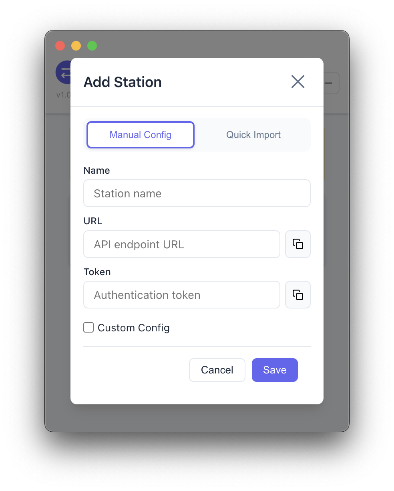

<div align="center">


# 🌉 CC Bridge

**Manage Claude Code & Codex transfer stations from one desktop app**

[](https://opensource.org/licenses/MIT)
[](https://github.com/aydomini/CC-Bridge/releases)
[]()

---

### [English](README_EN.md) | [中文](README.md)

</div>

---

## ✨ Overview

CC Bridge is a **free & open-source** Electron + React desktop application designed for developers who frequently switch between multiple AI transfer stations. It supports both **Claude Code** and **OpenAI Codex** modes with a unified configuration experience.

### Core Features

- 🔄 **One-Click Station Switching**: Manage multiple transfer stations, apply configurations instantly, automatic backups
- 🔐 **Secure Encrypted Storage**: AES-256-CBC encrypted token storage with device-bound keys, locally encrypted
- ⚙️ **Flexible Configuration System**: Global defaults + per-station overrides + project-level config files
- 📝 **Project Config Editor**: Edit `CLAUDE.md` / `AGENTS.md` directly, manage project-level instructions and memory
- 💰 **Balance Tracking**: Set balance and currency for each station, monitor usage
- 🌍 **Bilingual UI**: Switch between English and Chinese, dark/light theme support
- 🖥️ **Menu Bar Tray**: Persistent tray icon for quick station/mode switching without opening the main window
- 📦 **Quick Import**: Claude mode supports JSON quick import with auto-fix for format issues (Chinese punctuation, missing commas, smart quotes, etc.)

> **Latest Version**: v1.2.5 - [Download](https://github.com/aydomini/CC-Bridge/releases)
> **Current Platform**: macOS (Apple Silicon). Windows / Linux / Intel Mac are planned—PRs welcome!

---

## 📸 Screenshots

<table>
  <tr>
    <td width="50%">
      
      <p align="center"><b>Main Interface (Light Mode)</b></p>
    </td>
    <td width="50%">
      
      <p align="center"><b>Main Interface (Dark Mode)</b></p>
    </td>
  </tr>
  <tr>
    <td width="50%">
      
      <p align="center"><b>Add Station Dialog</b></p>
    </td>
    <td width="50%">
      
      <p align="center"><b>Quick Import (JSON)</b></p>
    </td>
  </tr>
</table>

---

## 🎉 v1.2.5 Update

### Comprehensive Quick Import Enhancement

- ✨ **Dual-Mode Quick Import**: Both Claude and Codex modes now support quick import
  - **Claude Mode**: Supports environment variables + JSON format
  - **Codex Mode**: Supports environment variables + full TOML config
- 📝 **Detailed Placeholder Text**: Input boxes display format examples for ease of use
- 🔧 **Intelligent Format Detection**:
  - Auto-detect environment variable format (`KEY=VALUE`)
  - Auto-detect JSON format (Claude)
  - Auto-detect TOML format (Codex)
- 🧹 **Clean Empty Configs**: Environment variable imports no longer generate empty `{}` custom configs
- 🎯 **Fuzzy Key Matching**: Supports multiple token and URL key variants
  - Claude: `ANTHROPIC_AUTH_TOKEN`, `AUTH_TOKEN`, `TOKEN`, `API_KEY`, etc.
  - Codex: `OPENAI_API_KEY`, `API_KEY`, `TOKEN`, `KEY`, etc.
  - URL: `BASE_URL`, `API_URL`, `ENDPOINT`, `URL`, etc.

**Claude Mode Quick Import Examples**:

Environment variables:
```bash
ANTHROPIC_AUTH_TOKEN=sk-ant-xxxxx
ANTHROPIC_BASE_URL=https://api.example.com
```

JSON format:
```json
{
  "env": {
    "ANTHROPIC_AUTH_TOKEN": "sk-ant-xxxxx",
    "ANTHROPIC_BASE_URL": "https://api.example.com"
  }
}
```

**Codex Mode Quick Import Examples**:

Environment variables:
```bash
OPENAI_API_KEY=sk-xxxxx
BASE_URL=https://api.example.com
```

Full TOML config (auto-splits into override + additional configs):
```toml
model_provider = "openai"
model = "gpt-4"

[model_providers.custom]
base_url = "https://api.example.com"
wire_api = "openai"
requires_openai_auth = true

[[mcp_servers]]
name = "filesystem"
command = "npx"
args = ["-y", "@modelcontextprotocol/server-filesystem"]
```

### Bug Fixes

- 🐛 Fixed duplicate `# --- Advanced Configuration ---` marker in Codex config preview
- 🐛 Fixed empty `{}` config appearing after environment variable import
- 🐛 Unified config marker format between frontend preview and backend generation

---

## 📦 Installation

### macOS (Apple Silicon)

1. Download the latest `CC Bridge-x.x.x-arm64.dmg` from [Releases](https://github.com/aydomini/CC-Bridge/releases)
2. Mount the DMG and drag **CC Bridge** into the Applications folder
3. First launch requires bypassing Gatekeeper (adhoc-signed app):
   - **Method 1**: Right-click the app → Select "Open" → Click "Open" again
   - **Method 2**: System Settings → Privacy & Security → Find CC Bridge → Click "Open Anyway"
   - **Method 3**: Run in Terminal: `xattr -cr "/Applications/CC Bridge.app"`

> **Note**: The app is adhoc-signed (no paid Apple Developer certificate). All source code is public for security auditing.

---

## 🚀 User Guide

### 1️⃣ Select Mode

The app supports two modes that can be switched anytime:

- **Claude Code Mode**: Manage Claude Code CLI transfer station configs (`~/.claude/settings.json`)
- **Codex Mode**: Manage OpenAI Codex CLI transfer station configs (`~/.codex/config.toml` + `auth.json`)

Switch modes using the mode selector at the top of the main interface.

### 2️⃣ Add Stations

Click the **"+"** button in the top-right corner and fill in the station details:

| Field | Claude Mode | Codex Mode | Description |
|-------|-------------|------------|-------------|
| **Station Name** | Required | Required | A memorable name (e.g., "Production", "Test") |
| **Provider Key** | N/A | Optional | Provider identifier, defaults to domain-based key |
| **Base URL** | Required | Required | Transfer station API endpoint (e.g., `https://api.example.com`) |
| **Auth Token** | Required | Required | Claude: `ANTHROPIC_AUTH_TOKEN`, Codex: `OPENAI_API_KEY` |
| **Custom Config** | Optional | Optional | JSON configuration overrides merged with global defaults |
| **Balance** | Optional | Optional | Set balance and currency for expense tracking |

#### Quick Import

Click the "Quick Import" button to import configurations in the following formats:

- **Environment Variables**: `KEY=VALUE` format key-value pairs (supports multiple lines)
- **JSON Configuration** (Claude Mode): JSON object containing `env`, `permissions`, and other fields
- **TOML Configuration** (Codex Mode): Full TOML config, automatically split into override and additional configs

The app automatically fixes common format issues (Chinese punctuation, missing commas, smart quotes, etc.) and preserves all custom fields.

> 💡 For detailed format examples and feature descriptions, see the "v1.2.5 Update" section above.

### 3️⃣ Apply Configuration

Select the target station and click the **"Apply"** button:

- **Claude Mode**: Writes config to `~/.claude/settings.json`
- **Codex Mode**: Writes config to `~/.codex/config.toml` and `~/.codex/auth.json`

A timestamped backup is automatically created before applying (e.g., `settings.json.backup.1234567890`), keeping the most recent 1 backup. To restore, backup files are located in the same directory as config files.

> ⚠️ **Important**: If Claude Code CLI is running, you need to manually restart the CLI after applying the config.

### 4️⃣ Global Configuration

Click the **"⚙️ Global Config"** button at the top to edit:

#### Base Config

- **Claude Mode**: Edit default environment variables (`env`) and permissions config (`permissions`)
  - Supports arbitrary custom fields - add top-level fields like `timeout`, `retryAttempts`, etc.
  - The `env` field supports any custom environment variables (e.g., `MY_CUSTOM_VAR`)
  - Example:
    ```json
    {
      "env": {
        "API_TIMEOUT_MS": "30000",
        "CUSTOM_VAR": "value"
      },
      "permissions": {
        "allow": ["read", "write"],
        "deny": []
      },
      "timeout": 5000,
      "customSettings": {
        "feature": "enabled"
      }
    }
    ```
- **Codex Mode**: Edit default model configuration (`model`, `model_provider`, etc.), also supports top-level custom field extensions

File path hints:
- Claude: `~/.claude/settings.json`
- Codex: `~/.codex/config.toml` + `~/.codex/auth.json`

#### Project Config

Edit project-level configuration files directly in the app:

- **Claude Mode**: Edit `~/.claude/CLAUDE.md`
- **Codex Mode**: Edit `~/.codex/AGENTS.md`

These files store project-level system prompts, memory banks, workflow rules, etc., and apply to all sessions.

Saves automatically create backups, keeping the most recent 1 version.

### 5️⃣ Menu Bar Tray

The app resides in the menu bar for quick operations:

- **Mode Grouping**: Claude / Codex stations listed separately
- **One-Click Switching**: Click station name to apply config without opening the main window
- **External Warning**: If config files are modified externally (not managed by this app), ⚠️ warning is displayed
- **Mode Indicator**: The active mode is marked with "(Active Mode)"

---

## 🛠️ Local Development

### Requirements

- **Node.js** 16 or higher
- **npm** 7 or higher
- **git**

### Quick Start

```bash
# Clone repository
git clone https://github.com/aydomini/CC-Bridge.git
cd CC-Bridge

# Install dependencies
npm install

# Development mode (with hot reload)
npm run dev

# Build production version
npm run build

# Package app
npm run package
```

### Project Structure

```
CC-Bridge/
├── electron/                # Electron main process
│   ├── main.ts              # App entry, window management, tray menu
│   ├── preload.ts           # IPC security bridge
│   └── services/            # Core services
│       ├── configManager.ts # Station & config management
│       ├── settingsWriter.ts# Config file writer
│       └── encryption.ts    # AES-256 encryption service
├── src/                     # React renderer process
│   ├── App.tsx              # Main UI logic
│   ├── components/          # UI components
│   │   ├── StationList.tsx  # Station list
│   │   ├── StationDialog.tsx# Add/edit station
│   │   ├── BaseConfigDialog.tsx # Global config + project config
│   │   └── ...
│   ├── contexts/            # React Context
│   │   ├── ThemeContext.tsx # Theme management
│   │   └── LanguageContext.tsx # Multi-language management
│   └── types/               # TypeScript type definitions
└── build/                   # Static assets (icons, signing config)
```

### Tech Stack

- **Frontend**: React 18 + TypeScript + Vite
- **Backend**: Electron + Node.js
- **Encryption**: crypto (AES-256-CBC)
- **Storage**: electron-store (JSON)
- **Build**: electron-builder

---

## 🤝 Contributing

Contributions to CC Bridge are welcome! Please follow this workflow:

1. **Fork** this repository and create a feature branch from `main`
2. **Develop** with support for both Claude / Codex modes in mind
3. **Run** `npm run build` before submitting a PR to ensure it builds successfully
4. **Update** both Chinese and English READMEs synchronously
5. **Attach** test instructions or UI screenshots

### Report Issues & Feature Requests

- Submit Issue: [GitHub Issues](https://github.com/aydomini/CC-Bridge/issues)
- Feature Discussion: [GitHub Discussions](https://github.com/aydomini/CC-Bridge/discussions)

---

## ⭐ Star History

[](https://star-history.com/#aydomini/CC-Bridge&Date)

---

## 📄 License

This project is licensed under the [MIT License](LICENSE) - free to use, modify, and distribute.

---

<div align="center">

**Made with ❤️ for the Claude Code & Codex community**

If CC Bridge saves you time, give it a ⭐ Star!

</div>
